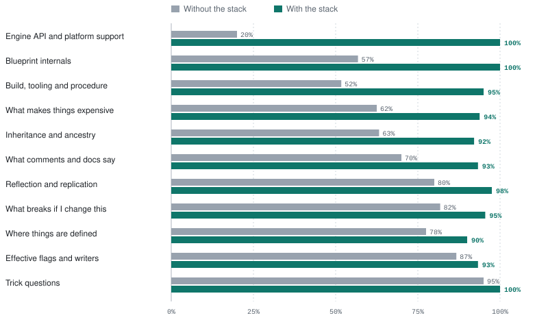
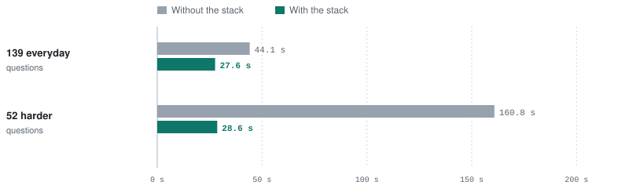

# Why an agent needs a memory stack

*Measured 20 September 2026 on Unreal Engine 5.8.3. Full result and caveats: [arm-comparison-v6.md](plugins/ue-memory-bench/bench/arm-comparison-v6.md).*

We gave the same model the same questions about a large Unreal Engine codebase twice. The first time it had shell and text search. The second time it also had the memory stack in this repository. **With the stack it got more right, got nothing outright wrong, and took a fraction of the time and tokens to get there.**

On the 139 everyday engineering questions:

| | Without the stack | With the stack |
|---|---|---|
| Correct, with partial credit | 68.3% | **95.0%** |
| Answers outright wrong | 26 | **0** |
| Total time | 3.6 hours | **1.2 hours** |
| Model calls (turns) | 1,841 | **867** |
| Input tokens per question | 200k | **93k** |

The questions cover three projects on Unreal Engine 5.8.3: Epic's Lyra sample game, an open-source plugin, and the small seed project in this repository.

---

## The gap is widest on the questions that cost you most

These are real questions from the run, with each agent's time and whether its answer was right.

| Question | Without the stack | With the stack |
|---|---|---|
| Which Blueprint is called into by other Blueprints most often, and how many have callers at all? | 865 s, 110 turns, 4.4M tokens. **Wrong** | 19 s, 7 turns. **Right** |
| Which custom events in Lyra's Blueprints are RPCs, and which of those are reliable? | Ran out of time at 900 s. **No answer** | 20 s, 7 turns. **Right** |
| Which Blueprint reads `NumBotsToCreate`, and how many nodes in it do so? | 828 s, 53 turns, 1.0M tokens. Right | 14 s, 3 turns. **Right** |
| If I rename `OnlineMode`, which Blueprint graphs break? C++ and Blueprint, the full list. | 825 s, 62 turns, 2.9M tokens. Right | 40 s, 9 turns. **Right** |
| How many plugins in this engine have a Runtime module that isn't available on a particular console? | **Wrong** | **Right**, on a machine with no console SDK installed |

Even where both agents get there, the one without the stack spends about 14 minutes and more than a million tokens rebuilding from raw asset bytes what the stack already holds. You pay that again on every question like it.

---

## It's better in every area we measured

The questions fall into eleven groups, and with the stack the agent scores higher in all eleven.

Scores use partial credit: a fully right answer counts 1 and a partly right one counts 0.5. Each group has between 8 and 30 questions. Blueprint internals, and most of the inheritance and effective-flags groups, come from the harder questions described below.

The biggest gains are where the answer isn't in any file a text search can read. In those groups an agent without the stack doesn't fail loudly; it makes something up. That's why the wrong answers matter most: **26 against none on the everyday questions, and 11 against none on the harder ones.** An agent that confidently tells you a property replicates to everyone when it's `COND_OwnerOnly` costs more than it ever saved, and a confidently wrong answer is cheap, so it never shows up in the token count.

---

## Why text search misses what the stack knows

A large Unreal project keeps much of its truth where text search can't reach. The stack reads those places ahead of time and serves the result as a query.

- **Blueprints are binary.** Part of any caller list lives in `.uasset` graphs, and `rg` skips them without a word. "Who calls this" comes back with only the C++ callers and looks complete. Rename the function and it still compiles.
- **The header isn't the whole story.** UnrealHeaderTool adds flags that are never written in the source: a `const` `BlueprintCallable` quietly becomes `BlueprintPure`. A property's replication condition lives in `GetLifetimeReplicatedProps`, not beside the property. The stack records the effective flags.
- **Some answers need no code at all.** Which modules are available on which platform is resolved from plugin descriptors by the engine's own rules. That's how the stack answers for a console on a machine with no console SDK installed.
- **Comments can be wrong.** One benchmark question turns on a header comment that describes behaviour the function doesn't have. The stack's routing sends the agent to the body as well as the comment, and that's how it gets caught.

---

## It stays fast when the questions get hard

52 of the questions were written to need exactly what the stack holds, so they're reported separately rather than folded into the headline. Without the stack, time goes up with difficulty. With it, time barely moves.

| | Without the stack | With the stack |
|---|---|---|
| **139 everyday questions** | | |
| Correct, with partial credit | 68.3% | **95.0%** |
| Answers outright wrong | 26 | **0** |
| Median time per question | 44.1 s | **27.6 s** |
| Input tokens | 27.8M | **12.9M** |
| **52 harder questions** | | |
| Correct, with partial credit | 66.3% | **96.2%** |
| Answers outright wrong | 11 | **0** |
| Median time per question | 160.8 s | **28.6 s** |
| Ran out of time | 2 | **0** |

The stack costs more context up front, 14,861 tokens a session against 7,615, and it still comes out cheaper on every measure, because it needs far fewer calls to reach an answer. All the figures above include that fixed cost.

---

## What's in the stack

Six layers, each there because the one below it can't answer a particular kind of question. The [README](README.md#the-stack) goes through them in detail.

| Layer | What it is | What only it can answer |
|---|---|---|
| **5** | Design docs | Why a system is built the way it is |
| **4** | Instruction files with a routing table | Which layer to ask, so the agent stops grepping out of habit |
| **3** | Engine API store | What a module declares, and where it's available, for targets you never built |
| **2** | The reflection dump, one file per class and Blueprint | Effective flags, replication conditions, Blueprint callers |
| **1** | Symbol index, clangd fronted by Serena | Definitions and references resolved by a real C++ front end |
| **0** | `compile_commands.json` | Nothing on its own, but clangd can't parse Unreal source without it |

---

## Where plain search does as well

Questions about where something is defined get answered quickly either way, because the definition is usually one grep away. The stack is still more accurate there (78% to 90%), but it takes a little longer, so on that kind of question the win is accuracy rather than speed.

"Why is this built this way" still needs someone to write the design docs. The stack scores well on it only because somebody did, which is the point of Layer 5.

---

## How we measured it

Both agents used the same model on the same questions. The one without the stack ran in a clean copy of the tree holding only source, config and content, with five built-in tools and nothing we built: no language server, no MCP server, no rules files. The rule behind that is the one part of this that isn't a judgement call, so it's worth stealing: **the baseline gets nothing we built, and the codebase it's asked about isn't altered.**

Every answer was graded against a key three times, independently, and the majority grade is what's shown. Before publishing, every key that marked the stack down was re-derived from source, and eleven turned out to be wrong. The figures here use the corrected keys, and the corrections raised both agents' scores.

Semantic code search sits on the stack's side of that line, so these numbers answer "is this worth building", not "is it worth adding to a codebase that already has good semantic search". Answering that needs a third arm, and we haven't run it.

The full result, with its caveats and the questions we couldn't explain, is in [arm-comparison-v6.md](plugins/ue-memory-bench/bench/arm-comparison-v6.md). Read that before quoting a number from here. Group figures carry weight; single questions don't.

**Measure your own tree.** The generator in *plugins/ue-memory-bench/bench/tools* builds a question set from your own project's artefacts. There's a much cheaper check as well: the stack plugin carries four [`claude plugin eval` cases](plugins/ue-memory-stack/evals/README.md) that check a session opens the right artefact rather than grepping. That costs cents per commit and tells you routing works. It isn't a result.

**[Install the stack →](README.md#install)**
